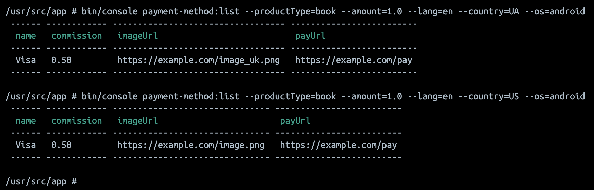

# Test Task for Booknet

[Посилання на опис завдання](https://github.com/booknet-company/test)

Файли, з котрих можна починати ознайомлення:

1. Схема бази даних: `.sql/00-schema.sql`
2. Початкові дані: `.sql/01-data.sql`
3. Точка входу: `app/bin/console`
4. Команда яка виводить дані: `app/src/Commands/PaymentMethodList.php`
5. Клас `PaymentTypeSelector` переїхав: `app/src/Services/PaymentType/Selector.php`

### Розпочати проєкт:

```shell
make start
```

### Виконати тест:

```shell
make test
```

### Зайти в PHP контейнер:

```shell
make app
```

### Зупинити та видалити контейнери проекту:

```shell
make stop
```

## Пару картинок:

### 1. Робота тестів:


### 2. Команда, котра надає список методів оплати:


### 3. Вивід роботи команди (список методів оплати):


